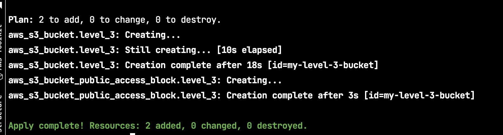

## What Are tfvars Files?

Tfvars files allow us to manage variable assignments systematically in a file with the extension .tfvars or .tfvars.json. Despite the fact that there are numerous ways to manage variables in Terraform, tfvars files are the best and most common way to do so due to their simplicity and effectiveness.

Knowing that the best way to learn new things is to do them ourselves, we’ll approach this hands-on to understand the various ways of managing variables in Terraform. In the code example below, we will set up a project to spin up an EC2 instance and learn about declaring and managing variables for it. There are code snippets as well as git repository code
to refer to at each step.

## Lab

Create file `s3.tfvars` content follow

```hcl
region                  = "us-east-2"
bucket_name             = "my-level-3-bucket"
block_public_acls       = true
block_public_policy     = true
ignore_public_acls      = true
restrict_public_buckets = true
```

Step by step:
- Run command `terraform init`
- Run command `terraform plan -var-file=s3.tfvars`
- Run command `terraform apply -var-file=s3.tfvars`
- Observe the expected result 


> Let none find fault with others; let none see the omissions and commissions of others. But let one see one's own acts,
> done and undone.
> — <cite>The Buddha</cite>
