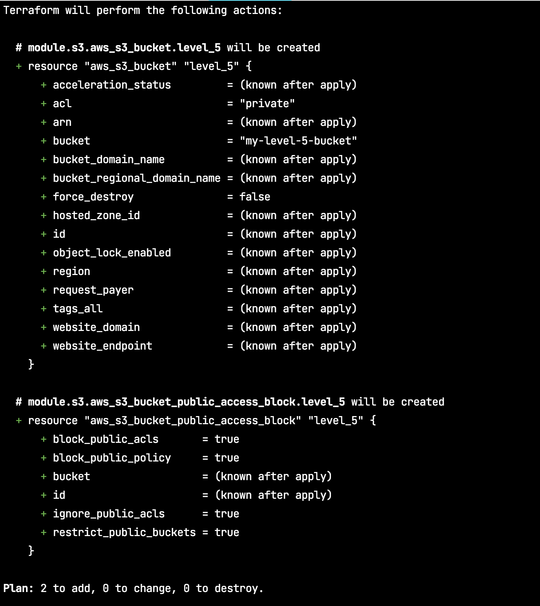

## What is terraform module 

## Terraform module pattern ? 

## Hand on lab 

```shell
terraform init 
```

```shell 
terraform plan -var-file=s3_module.tfvars
```



```shell
terraform apply -var-file=s3_module.tfvars -auto-approve
```


> The most formidable weapon against errors of every kind is reason.
> — <cite>Thomas Paine</cite>
