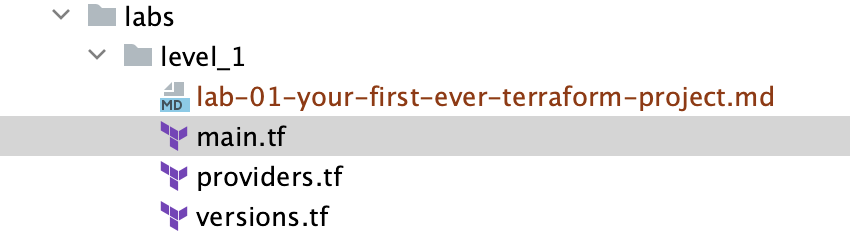
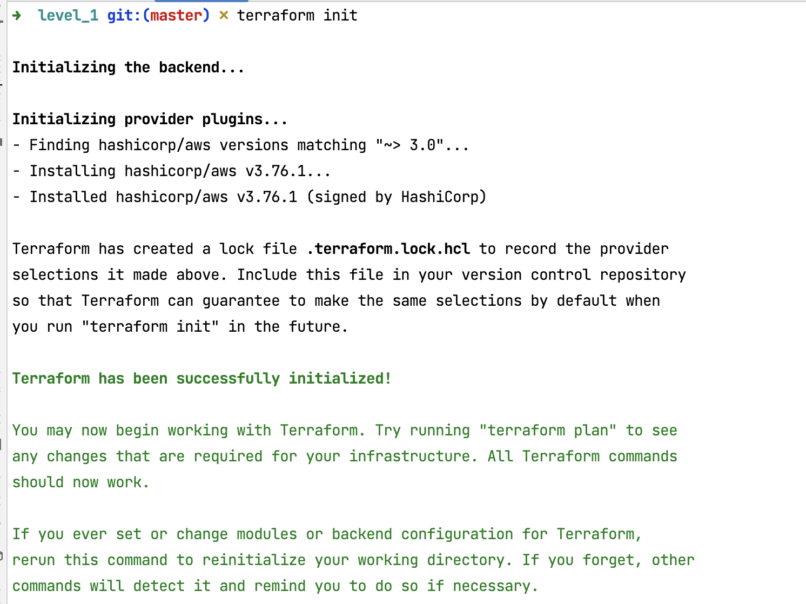
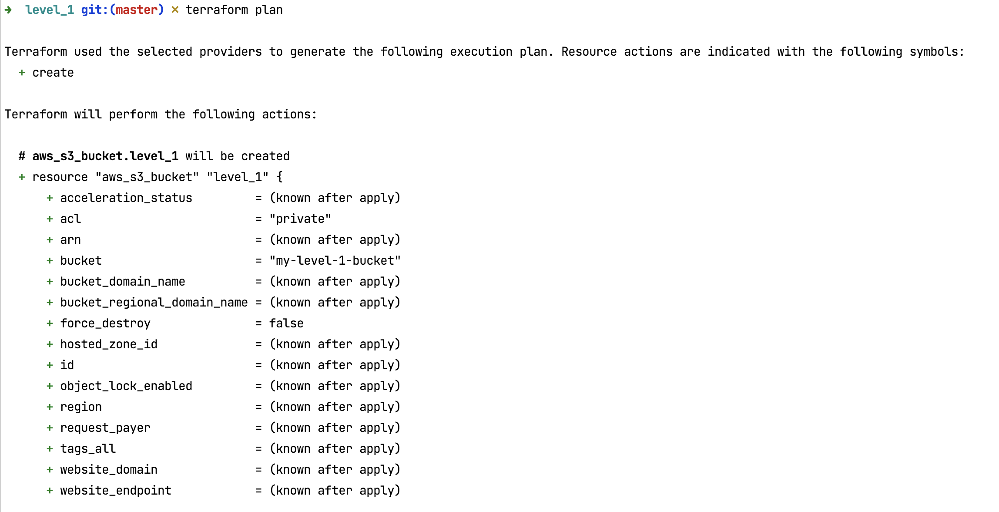
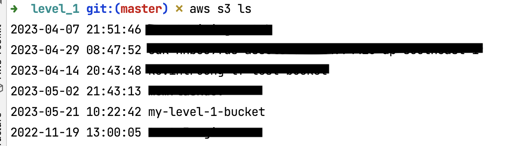
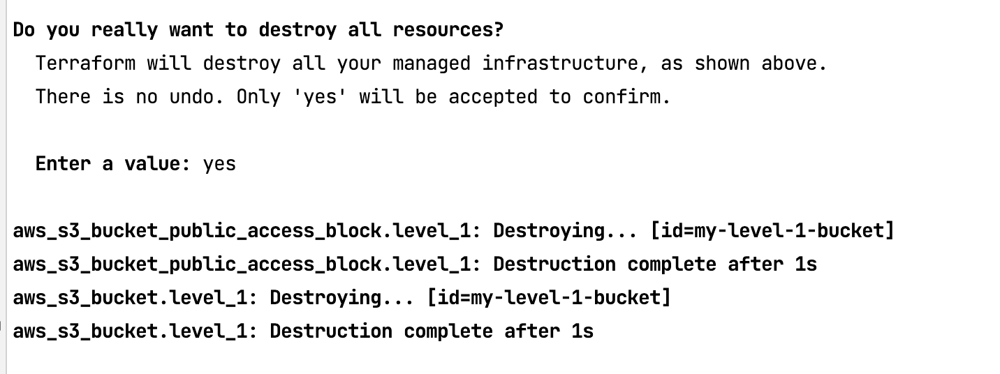

## Hand-on Lab : 





```hcl
#provider.hcl 

provider "aws" {  
region = "ap-southeast-1"  
}
```

```hcl
# main.hcl

resource "aws_s3_bucket" "level_1" {  
	# TODO ,add bucket name follow convention
	# <your_name>_tf_l1_devops
	bucket = ""
}  
  
resource "aws_s3_bucket_public_access_block" "level_1" {  
	bucket = aws_s3_bucket.level_1.id  
	block_public_acls = true  
	block_public_policy = true  
	ignore_public_acls = true  
	restrict_public_buckets = true  
}
```

```hcl
# version.hcl 

terraform {
  required_version = ">= 0.14"

  required_providers {
    aws = {
      source  = "hashicorp/aws"
      version = "~> 3.0"
    }
  }
}
```

### Getting start

What is provider ?

What is resource ?

### Deploy 

#### Terraform init
```shell 
terraform init
```


#### Terraform plan

```shell
terraform plan 
```




#### Terraform apply

```shell
terraform apply
```


- Check output resource is created by terraform 



### Terraform destroy 

```shell
terraform destroy
```




> Let none find fault with others; let none see the omissions and commissions of others. But let one see one's own acts, done and undone.
> — <cite>The Buddha</cite>


