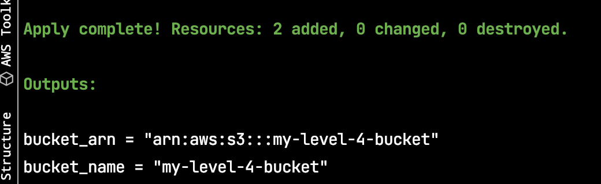

## Terraform output

- What is terraform output 


## Hand on Lab

- Create new file call `outputs.tf`
- Input content bellow:

```hcl
# outputs.tf
output "bucket_name" {
  description = "S3 bucket name."
  value       = aws_s3_bucket.level_4.id
}
output "bucket_arn" {
  description = "S3 bucket ARN."
  value       = aws_s3_bucket.level_4.arn
}
```

- Run plan command: `terraform plan`
- run apply command : `terraform apply -auto-approve -var-fille=s3.tfvars`
- Observe expected result

> We are what we repeatedly do. Excellence, then, is not an act, but a habit.
> — <cite>Aristotle</cite>
