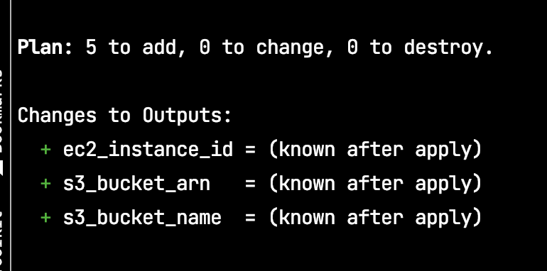
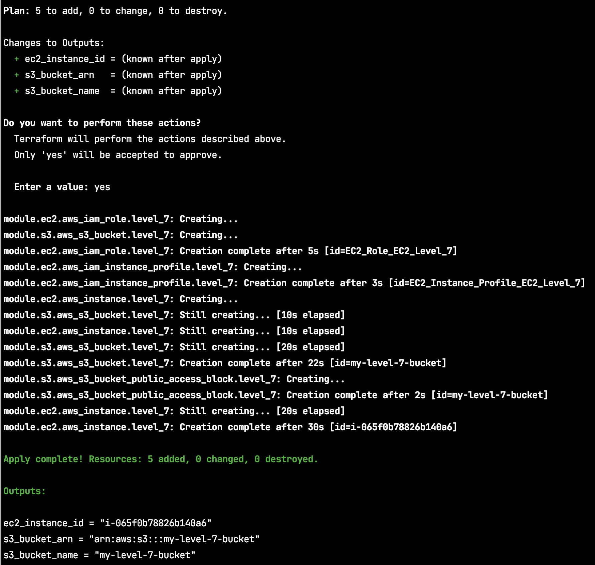

## Module output declarative syntax 

```hcl
#outputs.tf 

output "s3_bucket_name" {
  description = "S3 bucket name."
  value       = module.s3.bucket_name
}

output "s3_bucket_arn" {
  description = "S3 bucket ARN."
  value       = module.s3.bucket_arn
}
```

 `value = module.s3.bucket_name`


## Hand on lab

```shell
terraform plan -var-file=multiple_modules.tfvars
```



```shell
terraform apply -var-file=multiple_modules.tfvars -auto-approve
```




> To fly as fast as thought, you must begin by knowing that you have already arrived.
> — <cite>Richard Bach</cite>
